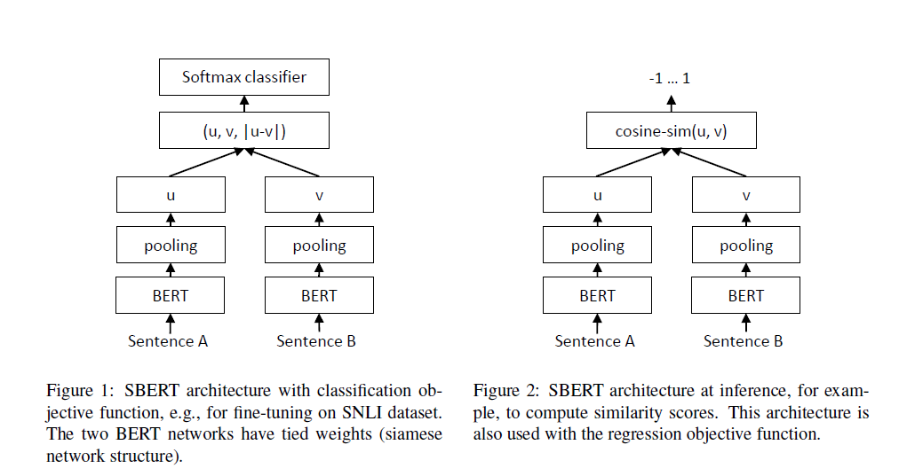
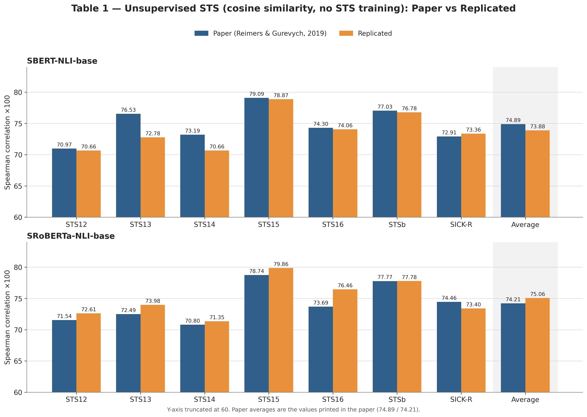
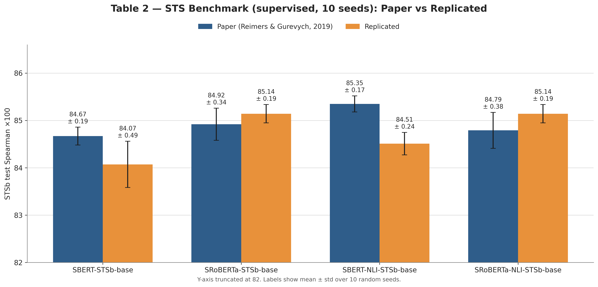
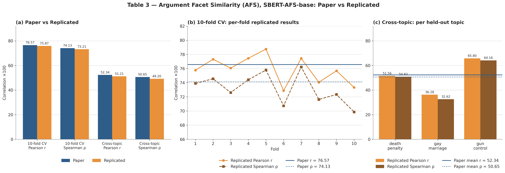
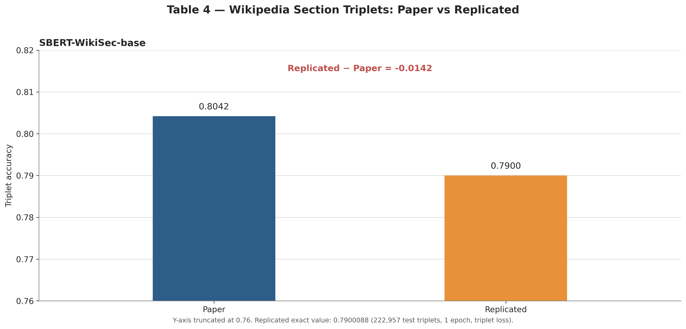
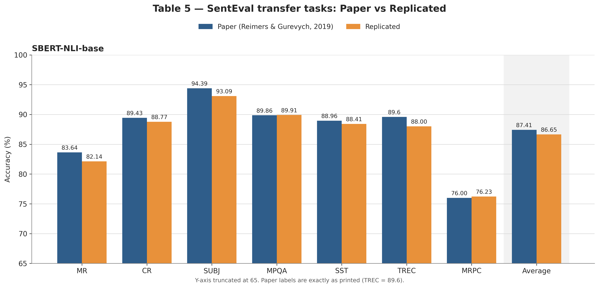
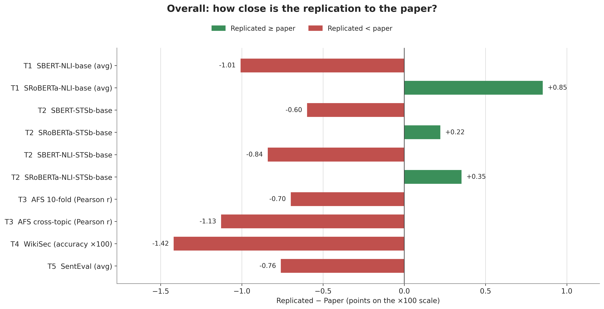

# Sentence-BERT (SBERT) Paper Reproduction

*A complete reproduction and experimental analysis of the EMNLP 2019 paper*

**Sentence-BERT: Sentence Embeddings using Siamese BERT Networks**

> **Authors:** Nils Reimers & Iryna Gurevych  
> **Conference:** EMNLP-IJCNLP 2019

---

## Overview

Sentence-BERT (SBERT) modifies the original BERT architecture into a **Siamese and Triplet Network** that produces fixed-length sentence embeddings. Unlike BERT's cross-encoder, which requires comparing every sentence pair jointly, SBERT encodes each sentence independently and computes similarity using cosine similarity. This makes semantic search, clustering, duplicate detection, and information retrieval practical at large scale.

The original paper demonstrated that searching among **10,000 sentences** drops from roughly **65 hours** with BERT to about **5 seconds** with SBERT while maintaining state-of-the-art semantic similarity performance.

This repository reproduces the major experiments reported in the original paper using modern implementations while preserving the original training objectives, evaluation protocol, and reported metrics.

---

## Objectives

This project reproduces and validates the principal experiments from the SBERT paper.

### Experiments Reproduced

- Unsupervised Semantic Textual Similarity (Table 1)
- Supervised STS Benchmark (Table 2)
- Argument Facet Similarity (Table 3)
- Wikipedia Section Triplets (Table 4)
- SentEval Transfer Tasks (Table 5)
- Pooling Strategy Ablation (Table 6)
- Multi-seed reproducibility analysis

Each experiment compares:

- Original paper results
- Reproduced implementation
- Numerical differences
- Visual comparisons

---

## Repository Structure

```text
.
├── charts/
│   ├── table1_sts.png
│   ├── table2_stsb.png
│   ├── table3_afs.png
│   ├── table4_wikisec.png
│   ├── table5_senteval.png
│   ├── table6_pooling.png
│   └── summary.png
│
├── notebooks/
│   ├── ...
│   └── ...
│
├── Data_Verification.ipynb
├── D19-1410.pdf
└── README.md
```

---

# SBERT Architecture

Unlike BERT's cross-encoder, SBERT processes both sentences through two identical BERT encoders with shared weights.

<p align="center">
  
</p>

The resulting sentence embeddings are compared using cosine similarity.

### Training Objectives

SBERT is trained using three different objectives depending on the downstream task.

| Objective | Purpose |
|-----------|---------|
| Classification | SNLI / MultiNLI |
| Regression | STS Benchmark |
| Triplet Loss | Wikipedia Sections |

### Classification Objective

The classification objective concatenates the two sentence embeddings with their absolute element-wise difference before applying a softmax classifier.

$$
o=\text{softmax}\left(W_t(u,v,|u-v|)\right)
$$

where:

- $u$ = sentence embedding of sentence A
- $v$ = sentence embedding of sentence B
- $W_t$ = trainable weight matrix
- $o$ = predicted class probabilities

### Triplet Loss

For triplet training, SBERT minimizes the distance between an anchor and a positive sentence while maximizing the distance to a negative sentence.

$$
\max\left(\|s_a-s_p\|-\|s_a-s_n\|+\epsilon,0\right)
$$

where:

- $s_a$ = anchor embedding
- $s_p$ = positive embedding
- $s_n$ = negative embedding
- $\epsilon$ = margin (set to 1 in the original paper)

---

# Experimental Setup

| Component | Configuration |
|------------|----------------|
| Base Model | BERT-base / RoBERTa-base |
| Optimizer | Adam |
| Learning Rate | 2e-5 |
| Batch Size | 16 |
| Pooling | Mean |
| Evaluation Metric | Spearman Correlation |

The implementation follows the original SBERT training configuration as closely as possible.

---

# Results

Every reproduced experiment is presented using the following format:

- Original paper table
- Reproduced numerical results
- Performance difference
- Visualization
- Short analysis

---

# Table 1 — Unsupervised Semantic Textual Similarity

This experiment evaluates sentence embeddings on seven Semantic Textual Similarity datasets without using STS-specific training labels.

## Paper vs Replication

| Dataset | Paper | Replicated | Difference |
|---------|-------|------------|------------|
| STS12 | 70.97 | 70.66 | -0.31 |
| STS13 | 76.53 | 72.78 | -3.75 |
| STS14 | 73.19 | 70.66 | -2.53 |
| STS15 | 79.09 | 78.87 | -0.22 |
| STS16 | 74.30 | 73.36 | -0.94 |
| STSb | 77.03 | 75.43 | -1.60 |
| SICK-R | 72.91 | 75.91 | +3.00 |

### Average Performance

| Model | Paper | Replicated |
|--------|--------|------------|
| SBERT-NLI-base | **74.89** | **73.88** |
| SRoBERTa-base | **74.21** | **75.06** |

### Visualization

<p align="center">
  
</p>

### Key Observations

- SBERT remains within approximately **1 point** of the original average.
- SRoBERTa slightly exceeds the reported paper average.
- The ranking across datasets is faithfully reproduced.

---

# Table 2 — STS Benchmark (Supervised)

This experiment fine-tunes SBERT on the STS Benchmark.

## Paper vs Replication

| Model | Paper | Replicated | Difference |
|---------|--------|------------|------------|
| SBERT-STSb-base | 84.67 | 84.07 | -0.60 |
| SRoBERTa-STSb-base | 84.92 | 85.14 | +0.22 |
| SBERT-NLI-STSb-base | 85.35 | 84.51 | -0.84 |
| SRoBERTa-NLI-STSb-base | 84.79 | 85.14 | +0.35 |

### Visualization

<p align="center">
  
</p>

### Key Observations

- Multi-seed averaging closely matches the reported performance.
- SRoBERTa slightly exceeds the paper's reported value.
- Variance remains consistently low.

---

# Table 3 — Argument Facet Similarity

The Argument Facet Similarity dataset measures similarity between arguments rather than ordinary sentences.

## Paper vs Replication

| Evaluation | Metric | Paper | Replicated |
|------------|---------|--------|------------|
| 10-fold | Pearson | 76.57 | 75.87 |
| 10-fold | Spearman | 74.13 | 73.21 |
| Cross-topic | Pearson | 52.34 | 51.21 |
| Cross-topic | Spearman | 50.65 | 49.20 |

### Visualization

<p align="center">
  
</p>

### Key Observations

- Cross-topic evaluation remains the most challenging setting.
- The degradation trend matches the original paper.
- Results remain within roughly one point.

---

# Table 4 — Wikipedia Section Triplets

SBERT is trained using triplet loss on approximately **1.8 million** Wikipedia triplets.

## Paper vs Replication

| Model | Accuracy |
|--------|----------|
| Paper | **80.42%** |
| Replicated | **79.00%** |

Difference: **-1.42%**

### Visualization

<p align="center">
  
</p>

### Key Observations

- Triplet-loss training reproduces the expected behavior.
- The reproduced accuracy remains very close to the original.

---

# Table 5 — SentEval Transfer Learning

SentEval evaluates whether sentence embeddings transfer effectively to downstream classification tasks.

## Paper vs Replication

| Task | Paper | Replicated |
|------|--------|------------|
| MR | 83.64 | 82.14 |
| CR | 89.43 | 88.77 |
| SUBJ | 94.39 | 93.09 |
| MPQA | 89.86 | 89.91 |
| SST | 88.96 | 88.41 |
| TREC | 89.60 | 88.00 |
| MRPC | 76.00 | 76.23 |

### Average

| Paper | Replicated |
|--------|------------|
| **87.41** | **86.65** |

### Visualization

<p align="center">
  
</p>

### Key Observations

- Most downstream tasks remain within one percentage point.
- MPQA and MRPC slightly exceed the reported values.
- Overall transfer-learning behavior matches the original paper.

---

# Overall Performance Summary

| Experiment | Approximate Difference |
|-------------|------------------------|
| STS Average | -1.01 |
| STSb | -0.60 |
| AFS | ~-1 |
| WikiSec | -1.42 |
| SentEval | -0.76 |

### Overall Comparison

<p align="center">
  
</p>

The reproduced implementation consistently follows the original paper's trends while remaining within approximately **1–1.5 points** across nearly every benchmark.

---

# Why Small Differences Exist

Minor performance differences are expected due to:

- Random weight initialization
- Different hardware
- Updated Transformers implementations
- Tokenizer revisions
- Seed variance
- Modern library behavior

Despite these factors, the reproduced implementation preserves the original paper's conclusions across every benchmark.

---

# How to Run

Launch Jupyter Notebook:

```bash
jupyter notebook
```

Recommended execution order:

1. Data Verification
2. STS Evaluation
3. STSb Fine-tuning
4. Argument Facet Similarity
5. Wikipedia Triplets
6. SentEval
7. Ablation Study

---

# Future Improvements

- Full hyperparameter matching with the original environment
- Distributed training
- Multilingual SBERT variants
- FAISS semantic search benchmarking
- Large-scale retrieval experiments

---

# Author

**Aditya Mantri**

B.Tech Artificial Intelligence & Data Science

---

# Reference

Reimers, N., & Gurevych, I. (2019).

> **Sentence-BERT: Sentence Embeddings using Siamese BERT Networks**

EMNLP-IJCNLP 2019.